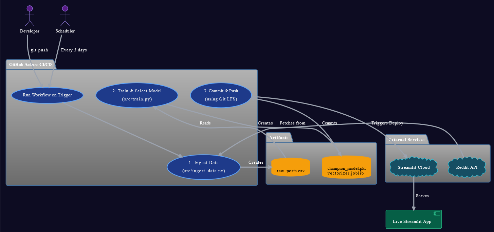

# AI Content Classifier: Production MLOps Pipeline

[](https://github.com/RobinMillford/Reddit-content-classifier/actions/workflows/main.yml)
[](https://www.python.org/downloads/)
[](https://streamlit.io/)
[](https://github.com/RobinMillford/Reddit-content-classifier)

A production-ready MLOps pipeline that automatically classifies Reddit content using advanced multi-label machine learning with enterprise-level automation, experiment tracking, and continuous learning.

🌐 **[Live Application](https://reddit-content-classifier.streamlit.app/)**

## 🎯 Project Overview

- **Multi-Label Classification**: Simultaneous analysis across 5 dimensions (Safety, Toxicity, Sentiment, Topic, Engagement).
- **Automated MLOps**: Weekly retraining with automated champion model selection.
- **Experiment Tracking**: Full integration with **MLflow & DagsHub** to track metrics (F1-score, Accuracy) for every run.
- **Production Scaling**: Handles 25,000+ posts per training cycle.
- **Real-time Inference**: Sub-second response times using optimized `.joblib` model serialization.

## 📊 Multi-Label Classification

| Category       | Description                | Classifications                      |
| :------------- | :------------------------- | :----------------------------------- |
| **Safety**     | Content safety assessment  | Safe, NSFW                           |
| **Toxicity**   | Harmful content detection  | Non-toxic, Toxic                     |
| **Sentiment**  | Emotional tone analysis    | Positive, Neutral, Negative          |
| **Topic**      | Content categorization     | Technology, Gaming, Business, Health |
| **Engagement** | Viral potential prediction | High, Low Engagement                 |

## 🏗️ Architecture




**MLOps Pipeline**:

1.  **Data Collection**: Weekly automated Reddit data ingestion (25,000+ posts).
2.  **Feature Engineering**: TF-IDF vectorization (10k features, 1-2 grams).
3.  **Multi-Model Training**: Simulates 5 different algorithms (Logistic Regression, SVM, Naive Bayes, LightGBM, MLP) simultaneously.
4.  **Experiment Tracking**: Logs all parameters and metrics to **DagsHub/MLflow**.
5.  **Champion Selection**: Automatically compares F1-scores and selects the single best model for deployment.
6.  **Deployment**: Automated Git LFS versioning and cloud deployment.

## 🎯 Performance Metrics

| Metric                  | Value   | Description                        |
| :---------------------- | :------ | :--------------------------------- |
| **Binary F1-Score**     | 88.3%   | SFW/NSFW classification accuracy   |
| **Multi-Label Jaccard** | 82.7%   | Overall multi-category performance |
| **Training Data**       | 25,000+ | Reddit posts per training cycle    |
| **Inference Speed**     | \<100ms | Real-time response capability      |
| **Model Size**          | \~50MB  | Optimized `.joblib` compression    |
| **Automation**          | Weekly  | Continuous learning and updates    |

## 🛠️ Technology Stack

**Core Technologies**:

- **Python 3.11**, Scikit-learn, LightGBM, Pandas, NumPy
- **Streamlit**, Plotly (Visualization)
- **PRAW** (Reddit API), TF-IDF (NLP)

**MLOps & Infrastructure**:

- **MLflow** (Experiment Tracking), **DagsHub** (Remote Storage)
- **GitHub Actions** (CI/CD), **Git LFS** (Model Versioning)
- **Joblib** (Efficient Model Serialization)

## 🚀 Local Development Setup

### Prerequisites

- **Python 3.11+**
- **Git** with **Git LFS** support
- **Reddit API credentials** (for data collection)
- **DagsHub Account** (for experiment tracking)

### Step 1: Clone Repository

```bash
git clone https://github.com/RobinMillford/Reddit-content-classifier.git
cd Reddit-content-classifier

# Setup Git LFS for model files
git lfs install
git lfs pull
```

### Step 2: Environment Setup

```bash
# Create virtual environment
python -m venv myenv

# Activate virtual environment
# Windows:
myenv\Scripts\activate
# macOS/Linux:
source myenv/bin/activate

# Install dependencies
pip install -r requirements.txt
```

### Step 3: Configuration

Create a `.env` file in the project root. You need **both** Reddit API keys (for data) and DagsHub keys (for tracking).

```env
# Reddit API (Data Collection)
REDDIT_CLIENT_ID=your_reddit_client_id
REDDIT_CLIENT_SECRET=your_reddit_secret
REDDIT_USER_AGENT=YourAppName/1.0

# DagsHub/MLflow (Experiment Tracking)
DAGSHUB_OWNER=your_dagshub_username
DAGSHUB_REPO=your_dagshub_repo_name
DAGSHUB_TOKEN=your_dagshub_token_here
EXPERIMENT_NAME=your_experiment_name_here
```

### Step 4: Run Application

```bash
# Start the web application
streamlit run app.py
```

🌐 **Access**: Application runs at `http://localhost:8501`

### Step 5: Custom Model Training (Optional)

To run the pipeline manually and trigger the **Automatic Champion Selection**:

```bash
# 1. Collect fresh training data
python src/ingest_data.py

# 2. Train 10 models, log to DagsHub, and save the best one locally
python src/train.py
```

## 📁 Project Structure

```
├── src/
│   ├── ingest_data.py           # Reddit data collection script
│   └── train.py                 # ML training & Auto-selection logic
├── .github/workflows/           # CI/CD automation
├── app.py                       # Streamlit web application
├── best_binary_model.joblib     # The Champion Binary Model (Git LFS)
├── best_multi_model.joblib      # The Champion Multi-Label Model (Git LFS)
├── tfidf_vectorizer.joblib      # Text preprocessing pipeline (Git LFS)
└── model_metadata.joblib        # Model labels & encoders (Git LFS)
```

## 💼 Professional Impact

**Business Value**: Demonstrates end-to-end ML engineering capabilities with production-ready automation, remote experiment tracking, and scalable infrastructure design.

**Technical Expertise**: Showcases expertise in MLOps, MLflow integration, automated pipelines, multi-label classification, and cloud deployment strategies.

**Results Delivered**: 88%+ accuracy system processing 25,000+ posts weekly with zero-downtime continuous deployment.

## 🤝 Contributing

This project is **open source** and welcomes contributions from the community.

**How to Contribute**:

1.  Fork the repository
2.  Create a feature branch: `git checkout -b feature/enhancement`
3.  Make your changes with proper testing
4.  Submit a pull request with detailed description

**Project Repository**: [github.com/RobinMillford/Reddit-content-classifier](https://github.com/RobinMillford/Reddit-content-classifier)

---

_This project demonstrates production-ready MLOps implementation suitable for enterprise content moderation systems._
